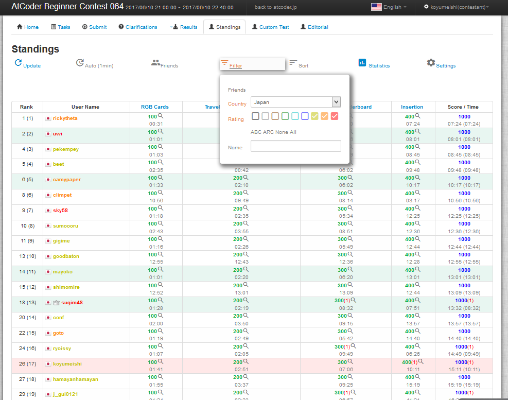
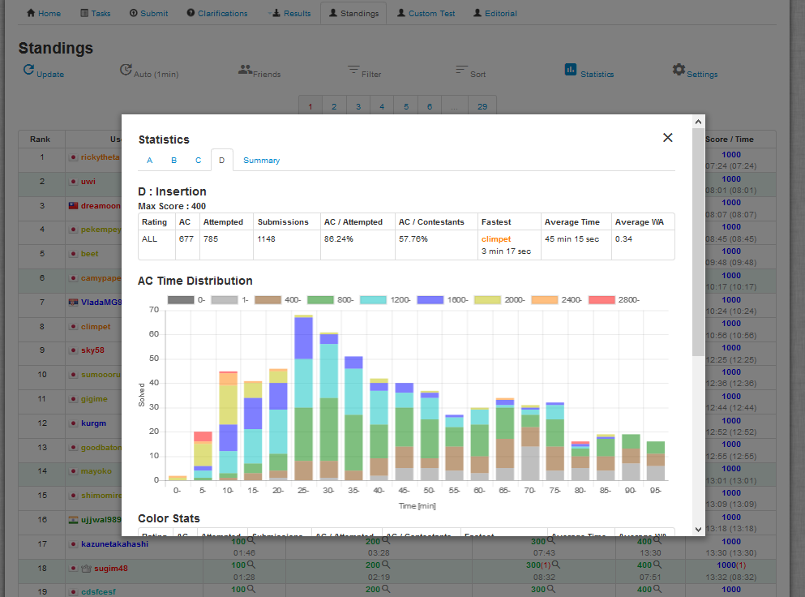

# Atcoder scripts
[@koyumeishi_](https://twitter.com/koyumeishi_) の UserScript置き場
##目録
* [AtCoderCustomStandings](#AtCoderCustomStandings)
* [AtCoderModalMoudarui](#AtCoderModalMoudarui)

## AtCoderCustomStandings 
### はじめに
AtCoderの順位表をカスタマイズして表示する非公式UserScriptです。 FirefoxのGreasemonkeyとGoogleChromeのTampermonkeyで動作確認しています。 javascript素人が書いたので予期せぬバグや、AtCoder側の仕様変更により使えなくなる場合があるかも知れません。 大切なコンテストでの使用は自己責任でお願いします。  
zerokugiさんのchrome拡張機能 [Atcoder Friend Standings](https://chrome.google.com/webstore/detail/atcoder-friend-standings/apoegnjnclihjjlighifiojbocjnbbgm) とは競合してしまうのでご注意ください。

### インストールとか

 1. Greasemonkey(Firefox)やTampermonkey(GoogleChrome)やらをブラウザにインストールしておく
 2. 次のリンクを開くとインストールするか尋ねられると思います  
     [https://koyumeishi.github.io/atcoder_script/ranking_script.user.js](https://koyumeishi.github.io/atcoder_script/ranking_script.user.js)

### 使用方法
    http://*.contest.atcoder/standings*
にアクセスすると、カスタマイズされた順位表が表示されます。  
>   
---
>   

1. friendだけの順位表を表示
2. ユーザー名をAtCoderIDで表示
3. Rating(β)に基づきユーザー名を色づけ
4. 1ページ当たりの表示件数(20,50,100,200,全件)

こんな感じのカスタマイズが出来ます。全件表示は結構重めなので非推奨です。  
friendの登録/解除は、登録/解除したいユーザーをクリックして出てきたメニューから行ってください。  
friend list等の設定はブラウザに保存されます。

### その他
#### レーティングについて
レーティングはARC(月1～月2ぐらい)のときに更新され、また、そもそもレーティング付きの人がそんなにいないので、手動でクローラ走らせて更新し、scriptに埋め込んでいます(5級まで。14KBほど)。 更新が遅かったら [@koyumeishi_](https://twitter.com/koyumeishi_)に催促してください。
クロールして取得したレーティング情報は [csv](https://koyumeishi.github.io/atcoder_script/rating.csv) や [json](https://koyumeishi.github.io/atcoder_script/rating.json) でも公開しています。何かの役に立てられる方はお使いください。

レーティングの色分け基準や配色に関しては特に考えて決めていません。 

>[function append_user_color_css()](https://github.com/koyumeishi/atcoder_script/blob/gh-pages/ranking_script.user.js#L314)  

に配色の設定、 

>[function get_color(user)](https://github.com/koyumeishi/atcoder_script/blob/gh-pages/ranking_script.user.js#L341)

に色分け基準レートの設定があります。

#### friend listについて
Greasemonkey や Tampermonkey が local strage 的なシステムを提供してくれているので、そこに保存しています。(参考: [http://wiki.greasespot.net/GM_getValue](http://wiki.greasespot.net/GM_getValue) )

    {name:1, name:1, ... , name:1}

のような形のjson文字列で保管しています。(値を1にしているのは連想配列で何らかの値を持たせておく必要があったため。評価にはkeyの存在判定しか使っていないのでnull等でも多分大丈夫)  
順位表のページでブラウザのコンソールから

    GM_getValue('GM_friend_list', null)
と叩くと多分見えます。

    GM_setValue('GM_friend_list', json文字列)
で更新できるので、手動でいじろうと思えばいじれます。

## AtCoderModalMoudarui 
<blockquote class="twitter-tweet" lang="ja">
☆AtCoder社に一言お願いします！ — モーダル閉じるの、もーだるい！ <a href="http://t.co/22Y32U6dQd">http://t.co/22Y32U6dQd</a>
&mdash; nico_shindannin (@nico_shindannin) <a href="https://twitter.com/nico_shindannin/status/514078969080344576">2014, 9月 22</a></blockquote>

って人向けにAtCoderのコンテスト開始時/終了時に表示されるモーダルを非表示にするscriptも書いてみました。 実際のコンテスト時に非表示になるか未確認ですが。  
[https://koyumeishi.github.io/atcoder_script/modal.user.js](https://koyumeishi.github.io/atcoder_script/modal.user.js)
  
