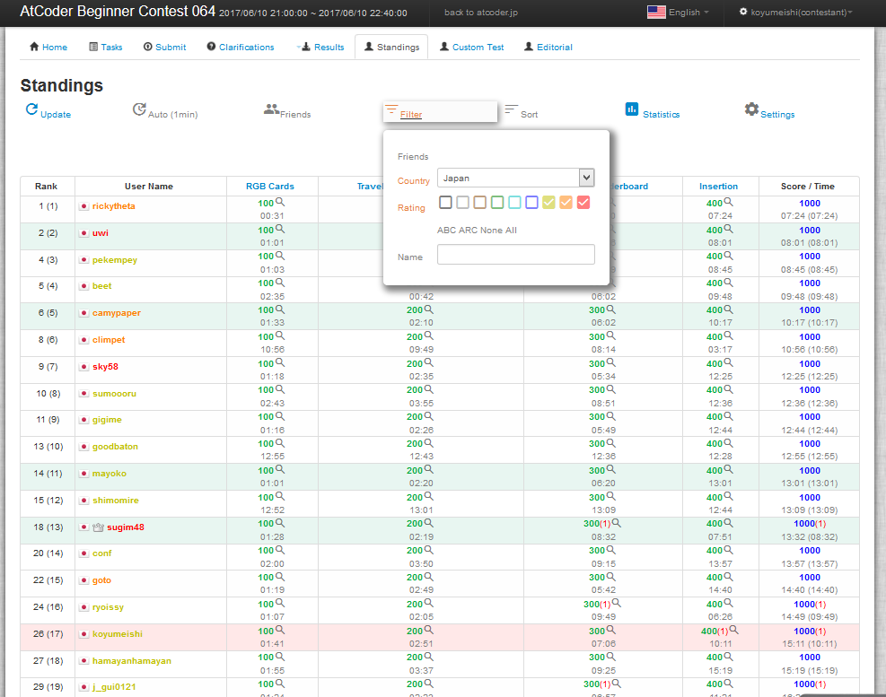
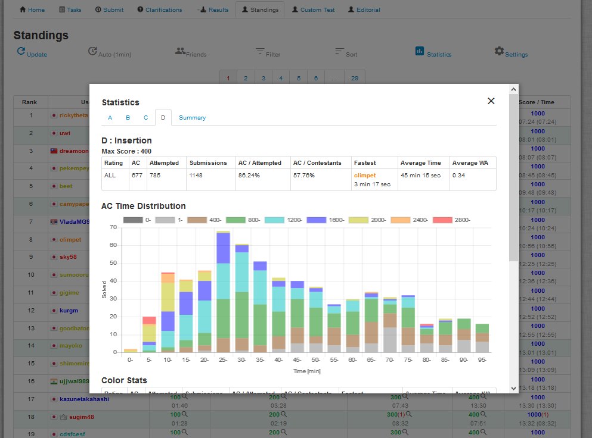

# AtCoderCustomStandings
UserScript to customize your standings page of [AtCoder](https://atcoder.jp/?lang=en).  
[https://koyumeishi.github.io/atcoder_script/atcoder_custom_standings.user.js](https://koyumeishi.github.io/atcoder_script/atcoder_custom_standings.user.js)

#### Japanese version is [here](readme.md)

* [Features](#Features)
* [Installation](#install)
* [Usage](#usage)
* [Release Notes](release_notes.md)
* [License](#license)

---

## Features

* Friends Standings
* Modify displaying number of people per page
* Auto reloading
* Filtering by country, rating and user name
* Statistics

## Installation

 1. Install Greasemonkey(Firefox) or Tampermonkey(GoogleChrome) on your browser (if you haven't installed)
 2. Open the link below and install the script  
     [https://koyumeishi.github.io/atcoder_script/atcoder_custom_standings.user.js](https://koyumeishi.github.io/atcoder_script/atcoder_custom_standings.user.js)

## Usage
This script runs at

    http://*.contest.atcoder.jp/standings*

* Filtering
>   

---
* Statistics  
>   

* Add / Remove friends  
    * open user detail menu clicking the user name of standings table, and then click "Add to Friends List" / "Remove from Friends List"
    * open settings and type the user name and click "Add Friends" button / select friens and click "Remove Friends".

All of the settings (including Friends List) are saved on your browser.

## License
MIT

